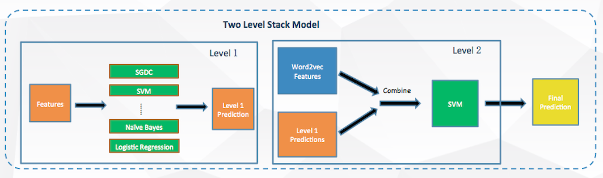

# Build User Frofiles with Search Terms

A user profile is a visual display of personal data associated with a specific user. A profile refers therefore to the explicit digital representation of a person's identity. As big data techniques become mature, companies can collect more data from billions users. Commercial search engines answer millions of queries on a daily basis while serving a variety of user intents. These queries can be valuable to help company to build use profiles to help improve the user experience and also improving the advertising profits. 

The critical challenge with building user profile is the effective. For the company, the key question is to accurately learn the user profile and provide adaptive services. In this competition, we will analyse the raw search terms from 20k users from chinese search engine SOUGOU (搜狗). The task is to build the basic profile like gender, age and education. 

### Data Description

|  	|  	description |  
|---	|---	|
|  ID	|  unique ID for each user	|  	
|  Age	|  0: unknow; 1: 0-18; 2: 19-23; 3: 24-30; 4: 31-40; 5: 41-50; 6: 51- 999	|  	
| Gender	|  0: unknow; 1: male; 2: female	|  	
| Education	|  0: unknow; 1: doctor; 2: master; 3: bachelor; 4: high school; 5: middle school; 6: junior school	|  	
| Query	|  search terms of the user	|  	

For example:

```
8FA7C82D0D9B05A17225D9E9F98814DF	1	2	5	一分钟打字多少个合格	附近的人找不到我	glare	魅族mx5e和mx5区别	http://ow24et3tetp6tvmk.onion/	是谁杀了我 而我又杀了谁第几集	软中华	暗网	何小茹最后跟谁在一起了	...	
2AD99288C8DC9FF267EC8E64ECEDD12E	2	1	4	统计学	英语	詹姆斯九月	同房不换什么意思	马云儿子	东莞大朗汽车站到中山	大朗汽车站到中山	汕头朥饺做法	...	   	
7FEAB95EFE061E05A966084F0966F3F8	3	1	3	打美女屁股	让子弹飞	后宫漫画	少女	古装露肚兜的电视剧	蝴蝶魔咒	火影忍者邪恶漫画	...
888A5A609252B4C28C416C784E045013	1	2	5	手机sd卡突然无法读取	安普素果冻	秋天的成语	英语四级多少分算过	豌豆靠什么传播种子	四面山光照	红斑狼疮能用面膜吗	...
574C0D49FE9CC606381D45DD19EBF9E9	2	1	4	结婚横幅	移动怎么查询话单	力帆汽车	地球	夏季清淡的晚饭大全	结婚横幅标语大全	慢性前列腺炎多久治愈	王健林唱歌视频	...
75448ACB877BE26E56A9B6B1FA930FE4	2	1	4	国产伟哥	环城路汇京宫	猪猪农场愚公	云盘	小说速成大纲	有没有什么好看的电影	遗精是病吗	台式电脑换内存条	...
D55B06F8401E4BCB663B0AA8A4BBD02D	3	2	3	微信发的信息为什么不能上下翻	一个瓶子等于一面镜子是什么成语	微盘是什么	什么热闹填动词	什么的粉墙	中秋节的由来及美食手抄报	什么的国旗	一个球上写着11是什么东西	...
660E4C1C0A2B3BF839656C0B9BF3B24E	3	1	1	三菱电机中央空调价格	臻武之境全集txt下载	残奥会奖牌榜	大金空调怎么样	蒋孝章	苏州新闻	臻武之境	苏州大观园二期	苏州58同城 ...
679B9B40B1545CEE967503FB0685C2C6	2	1	5	电脑有漏洞要不要修复	英语	济南到济宁长涂汽车	西游记后传唐僧扮演者	恐怖视频短片	马云学了计算机才会创建的阿里巴巴吗	...
3AE234C85205784E796E90E130661621	2	2	4	纤体梅	辽宁省朝阳市法院电话	0225918329	大连财经学院公办民办	建设银行企业网银	成人高考有公安管理专业吗	铁西宏伟金都二手房	米西米西是什么意思	...
...
```

submission format format:		
	csv with four columns of ID, age, gender, education. For example:
	
```
000000010004576C616E000000040012 1 1 4
005B78A4E280B707B6CE3FCE13B788CB 4 2 3
```
	
Submissions from different teams are evaluate on the final accuracy. The final accuracy is calculated on the average of three predictions (age, gender, education). 

Only the predictions the same as the true values are counted as 1.

### Model Architecture



### Future improvement
* Use Doc2Vec instead of word2vec	
We use the everage of word vectors to represent one users search term. It ignores the informations of the sequence of words. Doc2Vec provide a better semantic representation for the whole sentences/paragraphs/documents. 

* Use other trained model instead of fit myself		
After I read the transfer learning, I am thinking why should I train the word2vec myself. There are many studies to fit model with larger documentations and could help a lot. One model is from google [word2vec](https://code.google.com/archive/p/word2vec/)

* Make more data cleaning to get better features in the step of wordcut, choose stop words. Now I only tried to search the meaning of search terms, there are other features can be extracted manually.

* Use XGBoost or Neural Network models. 

* Use Topic Model like LDA


### Official Description
竞赛概述

竞赛背景

"物以类聚，人以群分"这句古语不仅揭示了物与人的自组织趋向，更隐含了“聚类”和“人群”之间的内在联系。在现代数字广告投放系统中，以物拟人，以物窥人，才是比任何大数据都要更大的前提。如何把广告投放给需要的人，是大数据在精准营销中最核心的问题，如何越来越精确的挖掘人群属性，也一直是技术上的天花板。对于企业主来说，了解自身产品的受众有助于进行产品定位，并设计营销解决方案。本题目以精准广告中一个具体问题为例，希望发掘到数据挖掘的优秀人才。

竞赛简介

在现代广告投放系统中，多层级成体系的用户画像构建算法是实现精准广告投放的基础技术之一。其中，基于人口属性的广告定向技术是普遍适用于品牌展示广告和精准竞价广告的关键性技术。人口属性包括自然人的性别、年龄、学历等基本属性。

在搜索竞价广告系统中，用户通过在搜索引擎输入具体的查询词来获取相关信息。因此，用户的历史查询词与用户的基本属性及潜在需求有密切的关系。

举例如下：

1、 年龄在19岁至23岁区间的自然人会有较多的搜索行为与大学生活、社交等主题有关	
2、 男性相比女性会在军事、汽车等主题有更多的搜索行为	

3、 高学历人群会更加倾向于获取社会、经济等主题的信息	

本题目提供用户历史一个月的查询词与用户的人口属性标签（包括性别、年龄、学历）做为训练数据，要求参赛人员通过机器学习、数据挖掘技术构建分类算法来对新增用户的人口属性进行判定。